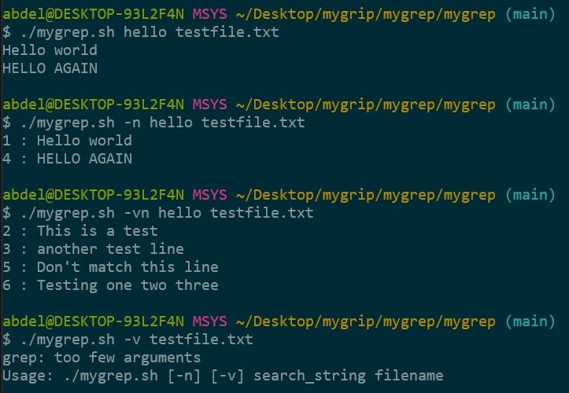

# Devops Task
this repo is for fawry DevOps intership task

### Implemenation Overview
My approach to implement mygrep was very simple and i will summraise it in the following steps.

1- Check if there's any invalid inputs(e.g., missing argument, the file do not exist, incorrect options)

2- Handle arguments and options

3- implement search

these are some text cases that show how the command is working


### Reflective Section

My script handles options using **getopts**:

- i checked the options of the commmand using getops inside a while loop

- i have created two variables ($show_number, invert) as a flags to set them as a true the if the options were included with command

- the $show_number variable is set to true if the option -n || -vn is included with the command 

- the $invert variable is set to true if the option -v || -vn is included with the command 

- We show error message if invalid option was passed as an input with the command

- i will use the variables later while searching for the string

````
show_number=false
invert=false

while getopts "nv" option; do
    case $option in
    n) show_number=true ;;
    v) invert=true ;;
    *)
        echo "invaild options: -$OPTARG "
        exit 1
        ;;
    esac
done

````